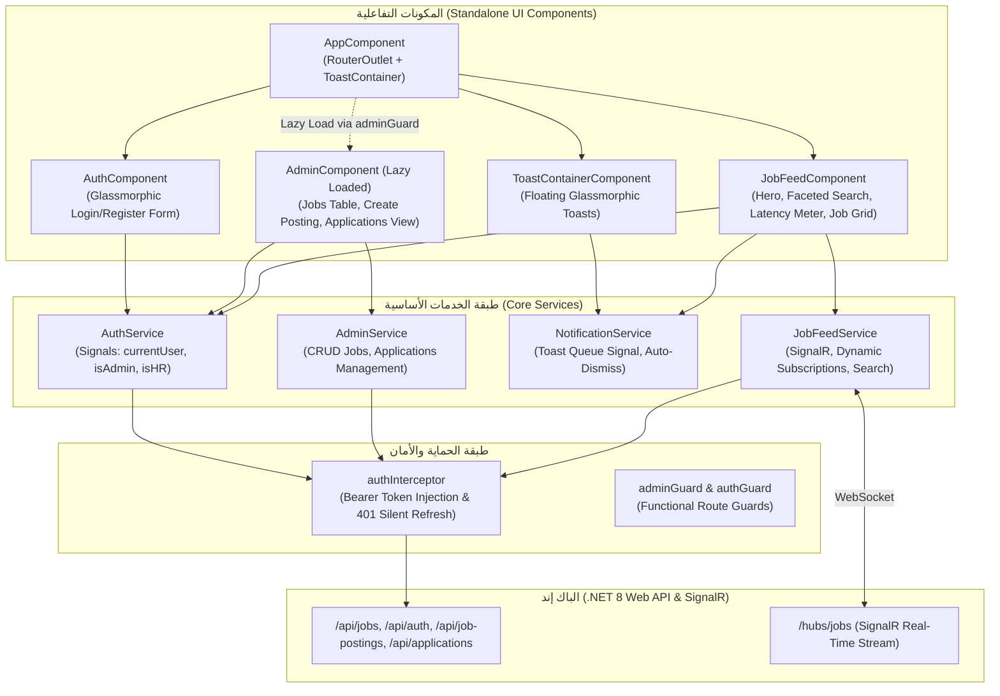

# 🎨 JobRadar — التوثيق الهندسي والمعماري الشامل للفرونت إند (Frontend Architecture & Deep Dive)

> **الإصدار:** 1.0.0  
> **إطار العمل:** Angular 17.3 (Standalone Architecture)  
> **إدارة الحالة:** Angular Signals (`signal`, `computed`, `effect`) + RxJS  
> **التصميم والتنسيق:** Vanilla CSS مع Glassmorphism و Dark Cyber-Theme بدون تبعيات إضافية  
> **التواصل اللحظي:** `@microsoft/signalr` مع Dynamic Relevance Subscription  
> **الحماية والمصادقة:** Functional Guards + Functional HTTP Interceptor مع Silent Token Refresh  
> **المسارات والتحميل:** Angular Router مع Lazy Loading لموديول لوحة التحكم (Admin Dashboard)  

---

## 📑 فهرس المحتويات

1. [نظرة عامة على المعمارية (Frontend Architecture Overview)](#1-نظرة-عامة-على-المعمارية)
2. [هيكل المشروع والملفات (Directory Structure)](#2-هيكل-المشروع-والملفات)
3. [إدارة الحالة والتفاعلية (Signals & State Management)](#3-إدارة-الحالة-والتفاعلية)
4. [مكون خلاصة الوظائف والبحث (Job Feed Component)](#4-مكون-خلاصة-الوظائف-والبحث)
5. [منظومة الاتصال اللحظي (SignalR Real-Time Integration)](#5-منظومة-الاتصال-اللحظي-signalr)
6. [نظام المصادقة وحماية المسارات (Auth & Security Architecture)](#6-نظام-المصادقة-وحماية-المسارات)
7. [لوحة تحكم المسؤول ومسؤولي التوظيف (Admin & HR Dashboard)](#7-لوحة-تحكم-المسؤول-ومسؤولي-التوظيف)
8. [نظام الإشعارات اللحظية (Toast Notification System)](#8-نظام-الإشعارات-اللحظية)
9. [التصميم وتجربة المستخدم (UI/UX Design System & Aesthetics)](#9-التصميم-وتجربة-المستخدم)
10. [إعدادات الخادم الوسيط والاتصال بالباك إند (Proxy & Backend Wiring)](#10-إعدادات-الخادم-الوسيط)
11. [دليل البناء والتشغيل (Build & Run Guide)](#11-دليل-البناء-والتشغيل)

---

## 1. نظرة عامة على المعمارية

تم بناء واجهة المستخدم لمشروع **JobRadar** باستخدام **Angular 17** بالاعتماد الكامل على **المكونات المستقلة (Standalone Components)** ونظام التحكم الجديد في القوالب (`@if`, `@for`). تم الاستغناء تماماً عن نظام الـ `NgModule` القديم لتقديم أداء فائق وسرعة تحميل متناهية مع معمارية تعتمد على الـ **Signals** لإدارة الحالة التفاعلية بدون تعقيدات أطر خارجية.



---

## 2. هيكل المشروع والملفات

يقع مشروع الفرونت إند في المسار [`src/jobradar-frontend`](file:///c:/Users/Dell/.gemini/antigravity-ide/scratch/JobRadar/src/jobradar-frontend):

```
src/jobradar-frontend/
├── proxy.conf.json                   # خريطة توجيه الطلبات و WebSockets للباك إند
├── package.json                      # التبعيات (Angular 17, @microsoft/signalr)
├── angular.json                      # تكوين بناء التطبيق ومسارات الأصول
├── src/
│   ├── index.html                    # صفحة الـ HTML الأساسية
│   ├── styles.css                    # استيراد خط Inter وإعدادات الـ Reset والـ Scrollbars
│   ├── main.ts                       # نقطة انطلاق التطبيق مع provideHttpClient و provideRouter
│   └── app/
│       ├── app.routes.ts             # جدول المسارات وتفعيل التحميل الكسول لـ Admin
│       ├── app.config.ts             # إعداد موفري الخدمات والإنترسبتور
│       ├── app.guards.ts             # حراس المسارات (adminGuard, authGuard)
│       ├── app.component.ts/.html    # المكون الجذري مع مشغل التوست
│       ├── auth/                     # موديول المصادقة وتسجيل الدخول
│       │   ├── auth.service.ts       # خدمة إدارة المستخدم والتوكن وحساب الصلاحيات
│       │   ├── auth.interceptor.ts   # الإنترسبتور الوظيفي مع تجديد التوكن الصامت
│       │   ├── auth.component.ts     # منطق تسجيل الدخول وإنشاء الحساب
│       │   ├── auth.component.html   # واجهة المصادقة الزجاجية مع تأثيرات الـ Glow
│       │   └── auth.component.css    # تنسيقات Glassmorphism والأزرار المتوهجة
│       ├── job-feed/                 # مركز خلاصة الوظائف والبحث اللحظي
│       │   ├── job.model.ts          # النماذج والتعدادات (Enums, DTOs, Criteria)
│       │   ├── job-feed.service.ts   # الاتصال بـ SignalR وإرسال طلبات البحث والزحف
│       │   ├── job-feed.component.ts # إدارة نموذج الفلترة، عداد السرعة، والتحديثات
│       │   ├── job-feed.component.html# الهيرو، الفلاتر الجانبية، شبكة بطاقات الوظائف
│       │   └── job-feed.component.css# تصميم لوحة القيادة التفاعلية وبطاقات الوظائف
│       ├── admin/                    # لوحة تحكم الإدارة ومسؤولي التوظيف
│       │   ├── admin.service.ts      # استدعاءات الـ API الخاصة بالوظائف والمتقدمين
│       │   ├── admin.component.ts    # التبديل بين التبويبات وإنشاء الوظائف وحذفها
│       │   ├── admin.component.html  # الشريط الجانبي وجداول البيانات ونموذج الإدخال
│       │   └── admin.component.css   # تنسيق لوحة البيانات الاحترافية
│       └── notifications/            # نظام التنبيهات والتوست العائم
│           ├── notification.service.ts# طابور التوست المبني على الـ Signals مع التلاشي التلقائي
│           ├── toast-container.component.ts  # مكون الحاوية العائمة للإشعارات
│           ├── toast-container.component.html# قوالب بطاقات التنبيه اللحظية
│           └── toast-container.component.css # حركات الظهور والتلاشي الزجاجية
```

---

## 3. إدارة الحالة والتفاعلية (Signals & State Management)

بدلاً من استخدام مكتبات خارجية تزيد من حجم حزمة التطبيق (مثل NgRx)، يعتمد JobRadar على **Angular 17 Signals** الأصلية لتحقيق تحديثات دقيقة للواجهة (Fine-grained Reactivity) بأعلى كفاءة ممكنة وبدون إعادة تصيير غير ضرورية:

### 3.1 الإشارات الأساسية (Signals)
- **`jobs = signal<JobSearchResultDto[]>([])`**: قائمة الوظائف المعروضة حالياً في الخلاصة.
- **`totalCount = signal<number>(0)`**: إجمالي عدد الوظائف المطابقة لشروط الفلترة.
- **`loading = signal<boolean>(false)`**: حالة تحميل البيانات لإظهار هياكل التحميل الوامضة (Shimmer Skeletons).
- **`syncing = signal<boolean>(false)`**: حالة تشغيل زاحف الويب الآلي لإظهار حركة الدوران في زر الكراولر.
- **`searchLatencyMs = signal<number | null>(null)`**: وقت الاستجابة الفعلي للاستعلام بالمللي ثانية المعروض في عداد السرعة `Latency Meter`.
- **`selectedSkills = signal<string[]>([])`**: المهارات المختارة في سحابة المهارات التفاعلية (بحد أقصى 10 مهارات).
- **`currentUserSignal = signal<CurrentUser | null>(null)`**: بيانات المستخدم المسجل وأدواره.
- **`toasts = signal<ToastNotification[]>([])`**: طابور الإشعارات العائمة اللحظية.

### 3.2 الإشارات المحسوبة (Computed Signals)
تُحسب قيمتها تلقائياً عند تغير الإشارة المصدرية وتُخزن في الذاكرة مؤقتاً (Memoized):
```typescript
public isAdmin = computed(() =>
  this.currentUserSignal()?.roles?.includes('Admin') ?? false
);

public isHR = computed(() =>
  this.currentUserSignal()?.roles?.includes('HR') ?? false
);

public isAdminOrHR = computed(() => this.isAdmin() || this.isHR());
```

### 3.3 التأثيرات التفاعلية (Signal Effects)
تستخدم للاستماع إلى أحداث البث المباشر القادمة من SignalR وإلحاق الوظيفة الجديدة في قمة قائمة الوظائف لحظياً:
```typescript
effect(() => {
  const newJob = this.jobService.newJobSignal();
  if (newJob) {
    this.jobs.update(currentJobs => [newJob, ...currentJobs]);
    this.totalCount.update(count => count + 1);
  }
}, { allowSignalWrites: true });
```

---

## 4. مكون خلاصة الوظائف والبحث (Job Feed Component)

يقع في [`src/app/job-feed/job-feed.component.ts`](file:///c:/Users/Dell/.gemini/antigravity-ide/scratch/JobRadar/src/jobradar-frontend/src/app/job-feed/job-feed.component.ts) ويمثل الشاشة الرئيسية للمستخدمين والباحثين عن عمل.

### 4.1 شريط التنقل العلوي (Dynamic Navigation Bar)
- **شعار التطبيق:** علامة `JobRadar` مع شارة `PRO SEARCH`.
- **مؤشر البث اللحظي (Live Sync Pulse):** نقطة متوهجة تنبض باللون الأخضر عند نجاح اتصال SignalR (`Live Sync Active`) وتتحول للأصفر عند إعادة الاتصال.
- **زر الزاحف الذكي (`btn-sync-crawler-nav`):** يتيح تشغيل دورة زحف فورية عبر الإنترنت لجلب أحدث الوظائف العالمية من Remotive و Arbeitnow و WeWorkRemotely.
- **منطقة المستخدم:** عرض الحرف الأول من اسم المستخدم داخل صورة رمزية أنيقة، وزر لوحة التحكم `Dashboard` (يظهر فقط لـ Admin و HR)، وزر تسجيل الدخول / الخروج.

### 4.2 قسم الترحيب والكبسولات السريعة (Hero Section & Quick Presets)
- إضاءات خلفية كروية متوهجة (`hero-orb`) تمنح الصفحة طابعاً تقنياً معاصراً.
- كبسولات الضغط السريع (Quick Preset Pills) لتفعيل فلاتر شائعة بنقرة واحدة:
  - 🌍 **Remote Only**: تفعيل خيار العمل عن بُعد.
  - 🕒 **Posted Today**: حصر الوظائف المنشورة خلال آخر 24 ساعة (`DatePostedFilter.Last24Hours`).
  - 💰 **$100k+ High Pay**: وضع حد أدنى للراتب يبدأ من 100,000 دولار.
  - ↺ **Reset Filters**: تصفير جميع الفلاتر والعودة للوضع الافتراضي.

### 4.3 لوحة الفلترة الجانبية المتقدمة (Faceted Filter Panel)
تعمل عبر نموذج تفاعلي `ReactiveForms` مع آلية تأخير زمني ذكية لمنع إغراق السيرفر بالطلبات:
```typescript
this.filterForm.valueChanges
  .pipe(
    debounceTime(350),
    distinctUntilChanged((prev, curr) => JSON.stringify(prev) === JSON.stringify(curr))
  )
  .subscribe(() => this.loadJobs());
```
وتتضمن الفلاتر التالية:
1. **حقل البحث النصي والدلالي (`query`):** يقبل الكلمات المفتاحية أو الجمل الطبيعية (مثل *"Senior .NET Architect remote"*).
2. **الموقع الجغرافي (`location`):** فلترة بالمدينة أو الدولة.
3. **مفتاح العمل عن بُعد (`isRemote`):** Checkbox مخصص بتصميم أنيق.
4. **خيارات الترتيب (`sortBy`):**
   - `AI Best Match` (الأفضل توافقاً مع الذكاء الاصطناعي عبر Cosine Distance).
   - `Newest First` (الأحدث نشراً - مسار سريع Fast-Path).
   - `Highest Salary` (الراتب الأعلى تنازلياً).
5. **تاريخ النشر (`datePosted`):** في أي وقت، آخر 24 ساعة، الأسبوع الماضي، الشهر الماضي.
6. **نوع التوظيف ومستوى الخبرة:** قوائم منسدلة مطابقة لتعدادات الباك إند (`FullTime`, `PartTime`, `Senior`, `Lead`...).
7. **نطاق الراتب السنوي (`salaryMin`, `salaryMax`):** مدخلان متوازيان بالدولار.
8. **سحابة المهارات التفاعلية (Skills Cloud):** رقائق مهارات جاهزة (`.NET`, `C#`, `Angular`, `TypeScript`, `Docker`, `PostgreSQL`...) تدعم التحديد المتعدد مع علامة صح خضراء وإمكانية إزالة المهارة بنقرة ثانية.

### 4.4 شبكة بطاقات الوظائف وعداد السرعة (Job Grid & Latency Meter)
- **عداد السرعة (Latency Meter):** يعرض زمن تنفيذ الاستعلام الفعلي بالمللي ثانية ومصدره (مثال: `⚡ 18ms Parallel Hybrid`).
- **بطاقات التحميل الوامضة (Shimmer Skeletons):** تظهر 6 بطاقات رمادية بنمط نبضي أثناء جلب البيانات لمنع تذبذب الواجهة (Layout Shift).
- **بطاقة الوظيفة (`job-card`):**
  - شارة `🔥 New Match` للوظائف الواردة لحظياً عبر SignalR مع تأثير وميض لوني.
  - أيقونة الشركة الرمزية بلون بارز واسم الوظيفة والشركة.
  - وسوم نوع العمل (عن بُعد، الموقع، نوع العقد، مستوى الخبرة، ونطاق الراتب المنسق مثل `$120k - $150k`).
  - شرائح المهارات المطلوبة مع شارة `+N` للمهارات الإضافية.
  - مؤشر نسبة التوافق الدلالي (`🎯 94% Match`).
  - زر التقديم السريع: يفتح رابط التقديم الخارجي إذا كان متوفراً، أو يسجل طلباً داخلياً باسم المستخدم إذا كانت الوظيفة داخلية مع فحص تسجيل الدخول.

---

## 5. منظومة الاتصال اللحظي (SignalR Real-Time Integration)

تتواجد الخدمة في [`src/app/job-feed/job-feed.service.ts`](file:///c:/Users/Dell/.gemini/antigravity-ide/scratch/JobRadar/src/jobradar-frontend/src/app/job-feed/job-feed.service.ts) وتتصل بمسار `/hubs/jobs`.

### 5.1 الاشتراك الديناميكي الذكي في المجموعات (Dynamic Criteria Group Subscriptions)
بدلاً من استقبال كل الوظائف العشوائية، تقوم دالة `updateCriteriaSubscriptions(criteria)` بتحويل الفلاتر الحالية للمستخدم إلى مجموعات SignalR متوافقة مع الباك إند والاشتراك بها تلقائياً:
- `grp:all`: الاشتراك العام لجميع المتصلين.
- `grp:remote`: عند تفعيل خيار العمل عن بُعد.
- `grp:loc:{slug}`: عند كتابة موقع معين.
- `grp:emp:{id}`: بحسب أنواع التوظيف المختارة.
- `grp:exp:{id}`: بحسب مستويات الخبرة المختارة.
- `grp:skill:{slug}`: لكل مهارة مضافة في الفلتر.

تقوم الخدمة بحساب الفارق بين المجموعات القديمة والجديدة وتقوم بفك الاشتراك من المجموعات الملغاة والاشتراك في المجموعات الجديدة بسلاسة تامة:
```typescript
// Leave groups that are no longer active
for (const group of this.currentSubscribedGroups) {
  if (!desiredGroups.has(group)) {
    this.leaveGroup(group);
  }
}

// Join new groups
for (const group of desiredGroups) {
  if (!this.currentSubscribedGroups.has(group)) {
    this.joinGroup(group);
  }
}
```

### 5.2 معالجة حدث الوظائف الواردة لحظياً
عند استقبال حدث `ReceiveRelevantJob`:
1. يتم تعيين الخاصية `job.isNew = true`.
2. يتم تحديث الـ Signal الخاص بـ `newJobSignal`.
3. يتفاعل `effect` في الـ Component ليضيف الوظيفة أعلى القائمة مع زيادة العداد.
4. تطلق الخدمة إشعار توست زجاجي فوري يضم عنوان الوظيفة والشركة ورابط المعاينة المباشر.

---

## 6. نظام المصادقة وحماية المسارات (Auth & Security Architecture)

### 6.1 خدمة المصادقة (`AuthService`)
تقع في [`src/app/auth/auth.service.ts`](file:///c:/Users/Dell/.gemini/antigravity-ide/scratch/JobRadar/src/jobradar-frontend/src/app/auth/auth.service.ts):
- تخزن الجلسة في `localStorage` مع استعادتها تلقائياً عند إعادة تحميل الصفحة (`restoreSession()`).
- تزود النظام بـ `currentUserSignal` والأدوار المحسوبة (`isAdmin`, `isHR`, `isAdminOrHR`).
- تدير دوال `login()`, `register()`, `logout()`, و `refreshToken()`.

### 6.2 الإنترسبتور الوظيفي وتجديد التوكن الصامت (`authInterceptor`)
يقع في [`src/app/auth/auth.interceptor.ts`](file:///c:/Users/Dell/.gemini/antigravity-ide/scratch/JobRadar/src/jobradar-frontend/src/app/auth/auth.interceptor.ts):
1. **حقن الرمز:** يقوم بحقن رأس `Authorization: Bearer <token>` تلقائياً في كل طلب صادر.
2. **التعامل مع خطأ 401 (Silent Refresh):**
   - إذا انتهت صلاحية الـ Access Token وأعاد السيرفر رمز `401 Unauthorized`، يقوم الإنترسبتور باعتراض الخطأ ومنع توجيه المستخدم لصفحة الدخول.
   - يستدعي `authService.refreshToken()` باستخدام الـ Refresh Token المخزن.
   - يقوم بوضع الطلبات المتزامنة الأخرى في طابور انتظار عبر `BehaviorSubject` حتى تنتهي عملية التجديد.
   - يعيد إرسال الطلب الأصلي برمز الـ JWT الجديد بنجاح ودون أن يشعر المستخدم بأي انقطاع في الخدمة.
   - إذا فشل التجديد (كان الـ Refresh Token ملغياً أو منتهياً)، يتم مسح الجلسة وتوجيهه لصفحة الدخول `/login`.

### 6.3 حراس المسارات (Route Guards)
مكتوبة بأسلوب Angular 17 Functional Guards في [`src/app/app.guards.ts`](file:///c:/Users/Dell/.gemini/antigravity-ide/scratch/JobRadar/src/jobradar-frontend/src/app/app.guards.ts):
- **`adminGuard`**: يتحقق عبر `auth.isAdminOrHR()`. إذا كان المستخدم مسجلاً وله دور `Admin` أو `HR` يُسمح له بالدخول، وإلا يتم توجيهه إلى `/` إذا كان مسجلاً أو `/login` إذا لم يكن مسجلاً.
- **`authGuard`**: يتحقق من تسجيل الدخول العام.

---

## 7. لوحة تحكم المسؤول ومسؤولي التوظيف (Admin & HR Dashboard)

توجد في [`src/app/admin/admin.component.ts`](file:///c:/Users/Dell/.gemini/antigravity-ide/scratch/JobRadar/src/jobradar-frontend/src/app/admin/admin.component.ts) وتُحمّل كسولاً (Lazy Loaded) لتوفير حجم الحزمة الأولى.

### 7.1 الشريط الجانبي والتبويبات
تحتوي اللوحة على ثلاثة أقسام رئيسية تُدار بإشارة `activeTab = signal<Tab>('jobs')`:
1. **إدارة الوظائف (Job Postings Tab):**
   - جدول تفاعلي يعرض جميع الوظائف المسجلة في النظام مع تفاصيل الشركة، الموقع، نوع التوظيف، مستوى الخبرة، وحالة التفعيل `isActive`.
   - زر حذف الوظيفة `deleteJob(id)` مع نافذة تأكيد واستدعاء `DELETE /api/job-postings/{id}` وتحديث الـ Signal محلياً.
2. **إنشاء وظيفة جديدة (Create Posting Tab):**
   - نموذج تفاعلي متكامل للتحقق من البيانات (`title`, `companyName`, `description`, `location`, `isRemote`, `salaryMin`, `salaryMax`, `employmentType`, `experienceLevel`).
   - عند الحفظ، يُرسل الطلب إلى `POST /api/job-postings`، والذي بدوره يقوم بحفظها وإطلاق بث فوري عبر SignalR لكافة المستخدمين المطابقين لمعايير الوظيفة في نفس اللحظة.
3. **طلبات التوظيف (Applications Tab):**
   - مراجعة جميع المتقدمين للوظائف مع أسماء المرشحين، وعناوين بريدهم الإلكتروني، وتاريخ التقديم، وحالة الطلب (`Applied`, `Reviewing`, `Interview`, `Accepted`...).

---

## 8. نظام الإشعارات اللحظية (Toast Notification System)

يقع في المجلد [`src/app/notifications`](file:///c:/Users/Dell/.gemini/antigravity-ide/scratch/JobRadar/src/jobradar-frontend/src/app/notifications):

### 8.1 ميزات التوست
- **طابور إشارات تفاعلي:** يدعم ما يصل إلى 5 إشعارات متزامنة مع ترتيب الأحدث في الأعلى.
- **أنواع الإشعارات المدعومة:**
  - `job`: مخصص لتنبيهات الوظائف الجديدة القادمة من SignalR مع شارة الموقع وزر الانتقال المباشر.
  - `success`: لتأكيد عمليات الحفظ أو اكتمال الزحف.
  - `warning`: للتنبيهات أو بلوغ الحد الأقصى للمهارات.
  - `info`: لرسائل النظام العامة.
- **التلاشي الذاتي (Auto-Dismiss):** تختفي الإشعارات العادية بعد 5 ثوانٍ، وتنبيهات الوظائف بعد 8 ثوانٍ مع إمكانية إغلاقها يدوياً.
- **التصميم:** بطاقة زجاجية عائمة (`backdrop-filter: blur(12px)`) في الزاوية العلوية اليمنى مع وميض حدود متدرجة.

---

## 9. التصميم وتجربة المستخدم (UI/UX Design System)

تم بناء التصميم بالكامل بـ **Vanilla CSS** حديث ومخصص لضمان خفة الوزن والتحكم المطلق:

### 9.1 لوحة الألوان والأساس البصري (Color Tokens)
- **الخلفية العميقة (Dark Cyber Canvas):** `#0a0a0f` و `#0f111a`.
- **البطاقات الزجاجية (Glassmorphic Panels):** خلفيات شفافة `rgba(255, 255, 255, 0.03)` مع حدود رفيعة `rgba(255, 255, 255, 0.08)` وضبابية خلفية `backdrop-filter: blur(16px)`.
- **ألوان التمييز والتدرجات (Accents & Gradients):**
  - تدرج الطاقة الأزرق والبنفسجي: `linear-gradient(135deg, #6366f1, #a855f7)`.
  - تدرج النجاح الأخضر: `#10b981`.
  - تدرج التنبيهات النارية: `linear-gradient(135deg, #f59e0b, #ef4444)`.
- **الخطوط والطباعة:** استيراد خط `Inter` بجميع أوزانه (300 إلى 800) مع تنعيم الخطوط على شاشات Retina.

### 9.2 الحركات التفاعلية الدقيقة (Micro-Animations)
- دوران أيقونة المزامنة عند النقر على `Auto-Crawl Web` عبر `@keyframes spin`.
- نبضات نقطة اتصال SignalR الخضراء عبر `@keyframes pulse`.
- تأثير التمرير ثلاثي الأبعاد والظلال المتوهجة (Glow Shadows) عند التحويم فوق بطاقات الوظائف.

---

## 10. إعدادات الخادم الوسيط (Proxy Configuration)

ملف [`proxy.conf.json`](file:///c:/Users/Dell/.gemini/antigravity-ide/scratch/JobRadar/src/jobradar-frontend/proxy.conf.json) يقوم بربط بيئة التطوير في Angular بخادم الـ ASP.NET Core API العامل على المنفذ `5000`:

```json
{
  "/api": {
    "target": "http://localhost:5000",
    "secure": false,
    "changeOrigin": true
  },
  "/hubs": {
    "target": "http://localhost:5000",
    "secure": false,
    "ws": true,
    "changeOrigin": true
  }
}
```

> [!IMPORTANT]
> تفعيل `"ws": true` في مسار `"/hubs"` يضمن ترقية اتصال HTTP إلى WebSocket عبر سيرفر Angular Dev Server بسلاسة تامة وبدون أي مشاكل في إعدادات الـ CORS.

---

## 11. دليل البناء والتشغيل (Build & Run Guide)

### 11.1 المتطلبات المسبقة
- **Node.js** إصدار 18 أو 20 فما فوق.
- مدير الحزم **npm**.
- بيئة الباك إند قيد التشغيل على `http://localhost:5000`.

### 11.2 أوامر التثبيت والتشغيل المحلي
من المجلد `src/jobradar-frontend`:
```bash
# 1. الدخول إلى مجلد الفرونت إند
cd src/jobradar-frontend

# 2. تثبيت الحزم والمكتبات
npm install

# 3. تشغيل خادم التطوير مع الـ Proxy
npm start
```
سيعمل التطبيق على الرابط: **`http://localhost:4200`**

### 11.3 بناء نسخة الإنتاج (Production Build)
```bash
npm run build
```
سيتم توليد الحزم المحسنة والمصغرة داخل مجلد `dist/jobradar-frontend` لتكون جاهزة للنشر على أي منصة استضافة ثابتة (مثل Vercel, Netlify, Cloudflare Pages, أو عبر النشر المباشر من مجلد `wwwroot` في ASP.NET Core).

---

## 🏁 خلاصة التقييم المعماري للفرونت إند

- **استجابة لحظية فائقة:** دمج متناغم بين استعلامات البحث المتوازية عبر الباك إند وتحديثات SignalR الدقيقة عبر Angular Signals.
- **تصميم عصري متفوق:** واجهة Dark Glassmorphic مستوحاة من أحدث منصات البرمجيات العالمية، خالية تماماً من التصاميم الافتراضية المبتذلة.
- **أمان متين وجلسات مستمرة:** تدوير صامت لرموز JWT دون مقاطعة تجربة المستخدم وحراسة صارمة لمسارات لوحة التحكم.
- **أداء استثنائي:** خفة وزن الحزم بالاعتماد على المكونات المستقلة والـ Lazy Loading ونظام التحكم الجديد بالقوالب.
