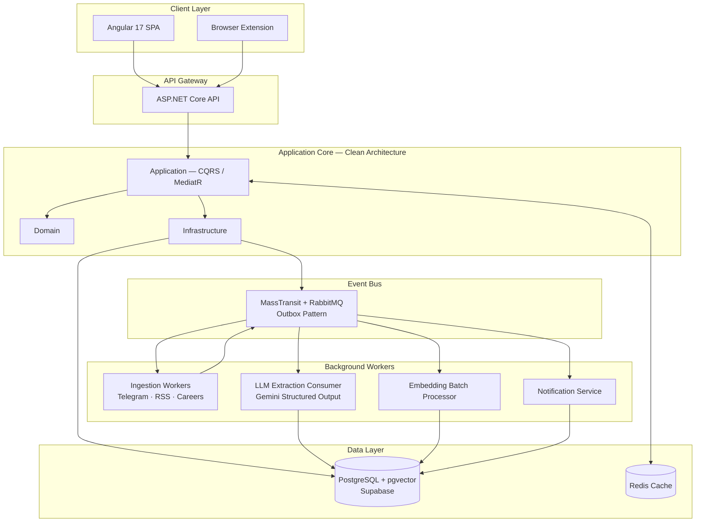

<div align="center">


<br/>


<br/><br/>

**[Features](#features)** &nbsp;·&nbsp; **[Architecture](#architecture)** &nbsp;·&nbsp; **[Tech Stack](#tech-stack)** &nbsp;·&nbsp; **[Getting Started](#getting-started)** &nbsp;·&nbsp; **[Roadmap](#roadmap)**

</div>

<br/>

## What is JobRadar?

Job hunters don't lose because opportunities don't exist. They lose because opportunities are **scattered** — buried inside Telegram channels, Facebook groups, LinkedIn feeds, and career pages nobody checks daily.

**JobRadar hunts them down the moment they're posted.**

It's not another job board. It's an aggregation engine that:

- Pulls postings from Telegram channels, RSS feeds, company career pages, and user-submitted sources — continuously, automatically
- Understands job descriptions semantically via RAG + vector search, not brittle keyword matching
- Notifies you the second a matching role drops, via Telegram or in-app
- Builds an ATS-optimized CV, scores it against any job in real time, and tells you exactly what's missing
- Grows itself — every user who adds a source strengthens the radar for everyone

<br/>

## Features

**Hybrid semantic search** — pgvector cosine similarity combined with structured filters (location, seniority, employment type). Search *"remote backend role, not too senior"* and get results that understand what you meant.

**Multi-source real-time ingestion**

| Source | Method |
|---|---|
| Telegram Channels | Official Bot API / MTProto — legal, stable |
| RSS Feeds | Standard feed parsing |
| Company Career Pages | Ethical, targeted scraping |
| LinkedIn / Facebook | Browser-extension "Capture Assist" — runs on the user's own session, no bot scraping |
| User-Submitted Sources | Community-driven, crowdsourced trust scoring |

**RAG-powered intelligence** — every posting is embedded, indexed with HNSW, and searchable in milliseconds. A Gemini extraction pipeline structures raw text into clean data at ingestion time.

**ATS CV builder** — multi-step builder with live PDF preview, one-click ATS match score against any job, missing-keyword detection, and tailored CV variants per application.

**Notifications that respect your attention** — Telegram-first alerts, smart digest mode (daily/weekly instead of spam), configurable match thresholds.

**Built like it's going to production** — Outbox pattern, idempotent consumers, Polly retry/circuit-breaker on every external call, FluentValidation on every boundary, rate limiting on expensive endpoints, structured logging with correlation IDs.

<br/>

## Architecture



**Design principles**

- **Clean Architecture** — Domain has zero dependencies; business logic lives in Application, not scattered across consumers or controllers
- **CQRS via MediatR** — every use case is an explicit, independently testable command or query
- **Modular Monolith → Microservices** — one deployable unit for speed and cost now, cleanly separable later
- **Outbox Pattern** — no dual-write inconsistency between DB state and published events
- **Idempotency by default** — every consumer is safe to redeliver

<br/>

## Tech Stack

| Layer | Technology |
|---|---|
| Backend | ASP.NET Core 8, Clean Architecture, MediatR (CQRS) |
| Frontend | Angular 17, Reactive Forms, Signals, SignalR |
| Database | PostgreSQL (Supabase) + pgvector, HNSW-indexed |
| Messaging | RabbitMQ + MassTransit (EF Core Outbox, Batch Consumers) |
| AI / LLM | Google Gemini — `gemini-1.5-flash` extraction, `text-embedding-004` embeddings |
| Search | Hybrid semantic + structured filtering via `EF.Functions.CosineDistance` |
| Caching | Redis — two-layer, embedding cache + results cache |
| Resilience | Polly — retry + circuit breaker on every external call |
| Validation | FluentValidation — pipeline behavior across all commands/queries |
| Background Jobs | Hangfire |
| PDF Generation | QuestPDF |
| Auth | Supabase Auth / JWT |
| Hosting | Oracle Cloud Always Free, Vercel/Netlify, Supabase |

<br/>

## Getting Started

**Prerequisites:** [.NET 8 SDK](https://dotnet.microsoft.com/download) · [Node.js 20+](https://nodejs.org/) & Angular CLI · Docker · a [Supabase](https://supabase.com/) project · a [Google AI Studio](https://aistudio.google.com/) API key

```bash
# 1. Clone
git clone https://github.com/3Abedalqader15/JobRadar.git
cd JobRadar

# 2. Local infrastructure (RabbitMQ + Redis)
docker compose up -d

# 3. Secrets
cd src/JobRadar.Api
dotnet user-secrets set "ConnectionStrings:Default" "<supabase-postgres-connection-string>"
dotnet user-secrets set "Gemini:ApiKey" "<gemini-api-key>"

# 4. Migrations
dotnet ef database update --project src/JobRadar.Infrastructure --startup-project src/JobRadar.Api

# 5. Run backend
dotnet run --project src/JobRadar.Api
dotnet run --project src/JobRadar.Workers

# 6. Run frontend
cd ../../client
npm install
ng serve
```

App runs at `http://localhost:4200` · API at `http://localhost:5000`

<br/>

## Project Structure

```
JobRadar/
├── src/
│   ├── JobRadar.Domain/          # Entities, enums — zero dependencies
│   ├── JobRadar.Application/     # CQRS use cases, validators, abstractions
│   ├── JobRadar.Infrastructure/  # EF Core, external service clients, consumers
│   ├── JobRadar.Api/             # Controllers, middleware, composition root
│   └── JobRadar.Workers/         # Hangfire jobs, MassTransit consumers
├── client/                       # Angular 17 application
├── scratch/                      # Smoke tests / scratch space
└── JobRadar-Project-Plan.md      # Full project planning document
```

<br/>

## Roadmap

- [x] Core domain model & ERD
- [x] Clean Architecture scaffolding
- [x] RSS + Telegram ingestion
- [x] LLM extraction pipeline (Gemini)
- [x] pgvector semantic search + Redis caching
- [ ] SignalR real-time feed
- [ ] ATS CV Builder + PDF generation
- [ ] Browser extension (LinkedIn/Facebook capture)
- [ ] Notification service (Telegram digest)
- [ ] Trending Skills Radar dashboard
- [ ] Public read-only API

<br/>

## Contributing

This is currently a solo-built portfolio project — issues, ideas, and PRs are welcome. Open an issue before a large PR so we can align on direction first.

## License

Distributed under the MIT License. See `LICENSE` for details.

<br/>

<div align="center">

Built by **[Abedalqader](https://github.com/3Abedalqader15)** — backend .NET developer, Irbid, Jordan

<sub>If JobRadar saved you from refreshing LinkedIn for the hundredth time, consider giving it a star.</sub>

<br/><br/>


</div>
